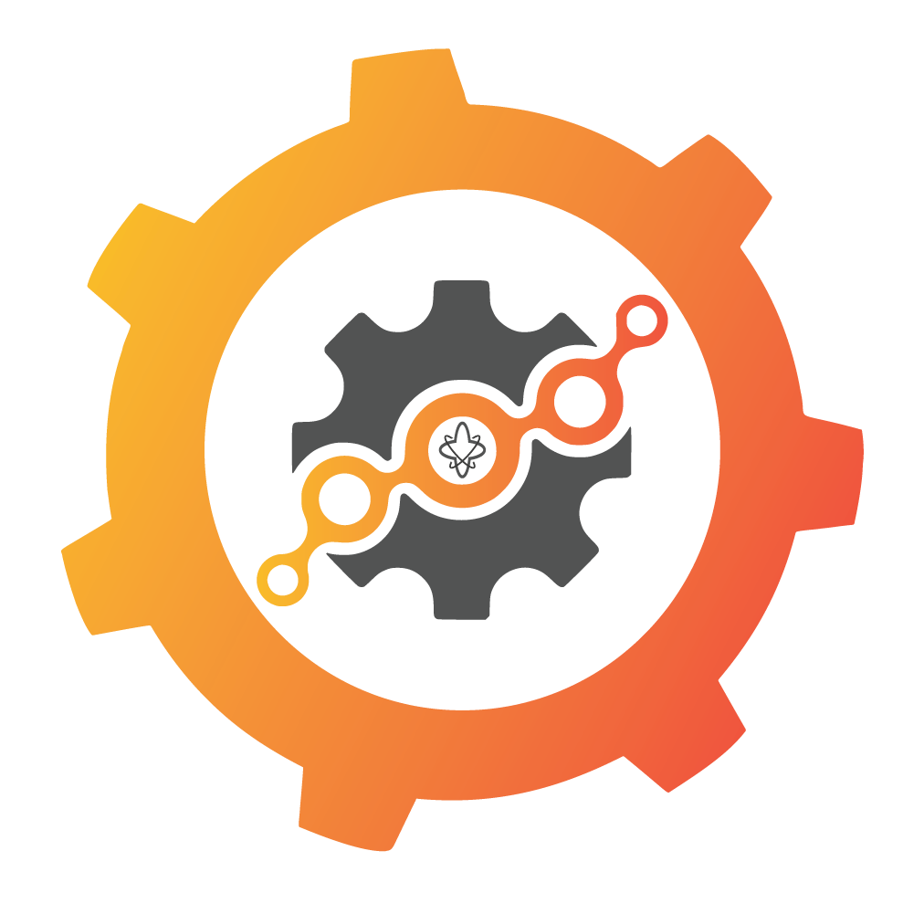

<b>Extensible open-source framework that Integrates & Scales your DevSecOps and MLOps stacks as you need</b>

# Kad

Universal **Integrator** - Framework to easily integrate with other tools/platforms to use their APIs, gRPC, DB, Workflows, etc. and also to develop workflows around them. This framework development is based on Temporal and NATS.

> name -Kad is Haitian Creole word, translates to framework.

############################
